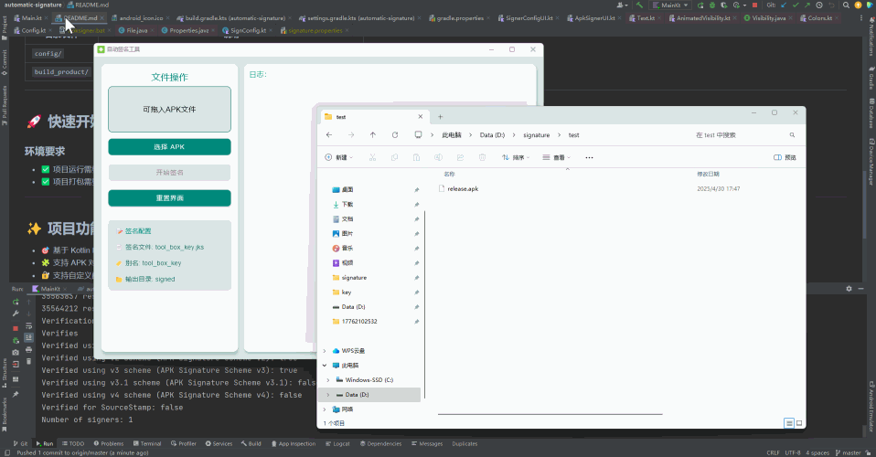

# 自动签名工具（Automatic Signature）

这是一个基于 [JetBrains Compose Multiplatform](https://github.com/JetBrains/compose-multiplatform) 开发的 Windows 桌面应用，目的是提供一键式 APK 对齐与签名的能力。

软件支持绿色免安装、软件签名配置自动生成（其中签名默认为debug，正式使用时还请替换为自己的）、软件也可以自定义签名配置，适用于 Android apk 文件自动构建签名流程。

---
## 📝 软件使用介绍


直接拖动或选择一个apk文件进来，然后点击开始签名，成功后会自动打开系统资源管理器并定位到对应文件。

左侧的签名配置栏，点击可以定位到对应的文件，这些都是可以替换的。

---

## 📁 软件使用中产生的目录文件说明

| 目录/文件              | 说明                                 |
| ------------------ |------------------------------------|
| `config/`          | 存放签名所需的配置文件与工具（首次启动自动生成, 可自定义替换配置） |
| `build_product/`   | 存放处理后的 APK 文件（已对齐、已签名）             |

---

## 🚀 快速开始

### 环境要求

* ✅ 项目运行需要 JDK 11（项目已通过 `jvmToolchain` 配置）
* ✅ 项目打包需要本地环境为 JDK 15 以上，我自己是JDK 17

---

## ✨ 项目功能特点

* 🎯 基于 Kotlin Multiplatform + Compose Desktop 开发
* 🧩 支持 APK 对齐（`zipalign`）与签名（`apksigner`）
* 🔐 支持自定义配置化签名密钥及参数
* 🛠️ 支持一键 zip 打包绿色软件

---

### 编译与运行

#### 运行项目

```bash
./gradlew run
```

#### 构建发布绿色免安装应用

```bash
./gradlew packageReleaseGreenSoftware
```